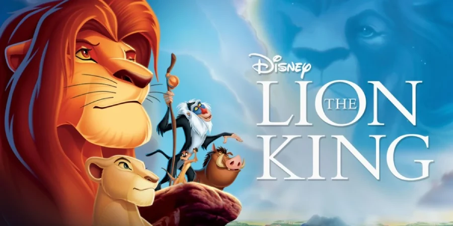

### MBIS Kahu Manu Film Studies 2025

# The Lion King

## In what ways does it show good & evil through its symbolism and use of light and darkness?

**The Lion King** is a very popular and iconic film on Disney being first released in 1994. It took about four to five years to make, earning over $968.5 million worldwide.

The film uses multiple sky backdrops in different scenes, but do you know why? You might think it would be just what time of day it is, but it's more than that. The animators add backgrounds depending on what is happening. For example, when Simba & Nala enter the Elephant Graveyard, the sky goes darker with lots of clouds.

### Fun Facts!
- The Lion King was originally going to be called "The King of the Jungle"
- The "Wildebeest Stampede" took 3 years to create and the result is **only three minutes long**
- The actors behind Timon and Pumbaa auditoned for the hyenas, but **the filmmakers loved their energy so much** that they ended up as Timon and Pumbaa

 

&nbsp;&nbsp;Written by James Trendall 
<a href="https://www.roblox.com/join/1r7p0">- Sky Sprint (Roblox Game)</a> 
<a href="https://jamesy-tech.github.io/jamesy-creator">- JamesyGames (Roblox Group)</a> 
<a href="https://jamesy-tech.github.io/jamesy-creator">- Jamesy Creator (Website)</a> 
